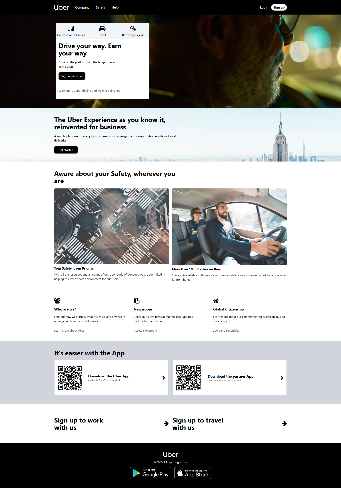

# Uber Layout with Tailwind CSS

This repository contains a simple implementation of an Uber-like layout using Tailwind CSS. The layout includes a header, a blog section, main content area, CTA section, and a footer. All with responsive design in mind. (Mobile-first approach)

## Desktop View

## Mobile View

